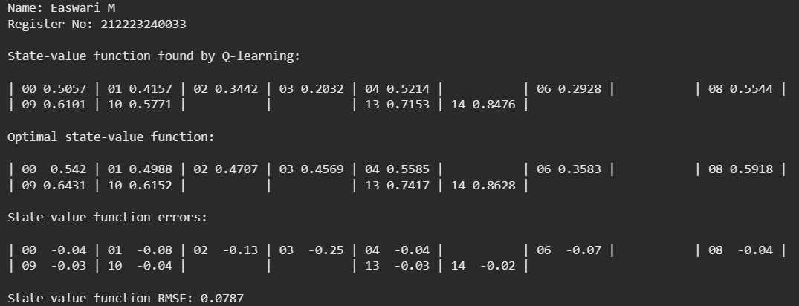
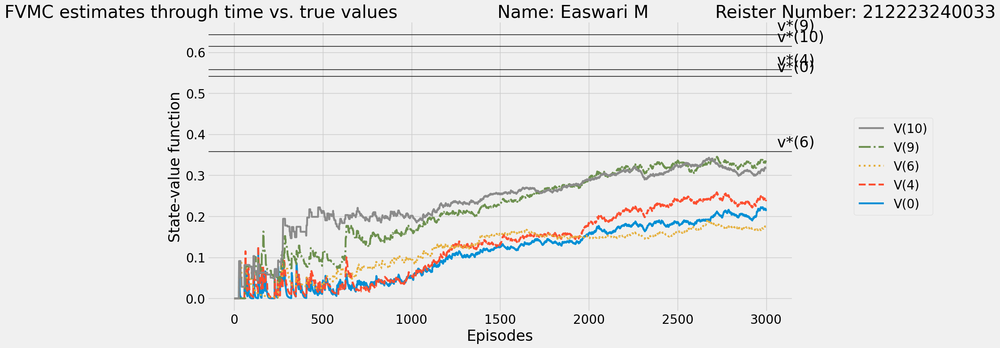

# Q Learning Algorithm


## AIM
To Create a Python program to find the optimal policy for the given RL environment using Q-Learning and compare the state values with the Monte Carlo method.

## PROBLEM STATEMENT
To develop a Python program to find the optimal policy using Q-Learning and compare state values with Monte Carlo method to plot the differences inbetween the methods.The value functions of the states are calculated through Q Learning function and Monte Carlo function respectively.Then the two algorithms are compared to visually plot which algorithm helps to find optimal policy better under different circumstances.

## Q LEARNING ALGORITHM

### Step 1:
Initialize Q-table and hyperparameters.

### Step 2:
Choose an action using the epsilon-greedy policy and execute the action, observe the next state, reward, and update Q-values and repeat until episode ends.

### Step 3:
After training, derive the optimal policy from the Q-table.

### Step 4:
Implement the Monte Carlo method to estimate state values.

### Step 5:
Compare Q-Learning policy and state values with Monte Carlo results for the given RL environment.

## Q LEARNING FUNCTION

### Name: Easwari M
### Register Number: 212223240033


*Q Learning Function*

```
def q_learning(env,
               gamma=1.0,
               init_alpha=0.5,
               min_alpha=0.01,
               alpha_decay_ratio=0.5,
               init_epsilon=1.0,
               min_epsilon=0.1,
               epsilon_decay_ratio=0.9,
               n_episodes=3000,
               max_steps=200): 
    nS, nA = env.observation_space.n, env.action_space.n
    pi_track = []
    Q = np.zeros((nS, nA), dtype=np.float64)
    Q_track = np.zeros((n_episodes, nS, nA), dtype=np.float64)

    alphas = decay_schedule(init_alpha,
                           min_alpha,
                           alpha_decay_ratio,
                           n_episodes)
    epsilons = decay_schedule(init_epsilon,
                              min_epsilon,
                              epsilon_decay_ratio,
                              n_episodes)

    select_action = lambda state, Q, epsilon: np.argmax(Q[state]) \
        if np.random.random() > epsilon \
        else np.random.randint(len(Q[state]))

    for e in tqdm(range(n_episodes), leave=False):
        state = env.reset()
        done = False
        for t in range(max_steps):
            action = select_action(state, Q, epsilons[e])
            next_state, reward, done, _ = env.step(action)
            Q[state][action] = Q[state][action] + alphas[e] * \
                               (reward + gamma * np.max(Q[next_state]) - Q[state][action])

            state = next_state
            if done:
                break

        Q_track[e] = Q
        pi_track.append(np.argmax(Q, axis=1))

    V = np.max(Q, axis=1)
    pi = lambda s: {s:a for s, a in enumerate(np.argmax(Q, axis=1))}[s]
    return Q, V, pi, Q_track, pi_track
```

## OUTPUT:

*State value function, optimal value function,error,RMSE value*


*Action value function,Optimal policy*


**Plot comparison between the state value functions**

 *Monte Carlo method*


*Q-Learning*


## RESULT:
Thus, Q-Learning outperformed Monte Carlo in finding the optimal policy and state values for the RL problem.