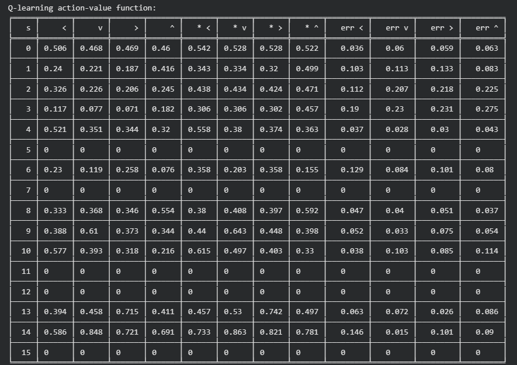
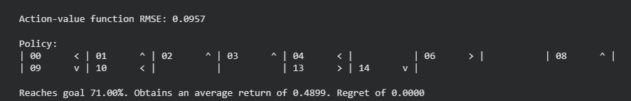
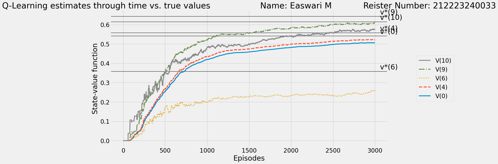

# Q Learning Algorithm

## AIM
To develop a Python program to find the optimal policy for the given RL environment using Q-Learning and compare the state values with the Monte Carlo method.

## PROBLEM STATEMENT
To develop a Python program to find the optimal policy using Q-Learning and compare state values with Monte Carlo method to plot the differences inbetween the methods.The value functions of the states are calculated through Q Learning function and Monte Carlo function respectively.Then the two algorithms are compared to visually plot which algorithm helps to find optimal policy better under different circumstances.

## Q LEARNING ALGORITHM

### Step 1:
Initialize Q-table and hyperparameters.

### Step 2:
Choose an action using the epsilon-greedy policy and execute the action, observe the next state, reward, and update Q-values and repeat until episode ends.

### Step 3:
After training, derive the optimal policy from the Q-table.

### Step 4:
Implement the Monte Carlo method to estimate state values.

### Step 5:
Compare Q-Learning policy and state values with Monte Carlo results for the given RL environment.

## Q LEARNING FUNCTION

### Name: Easwari M
### Register Number: 212223240033

*Q Learning Function*

## OUTPUT:

*State value function, optimal value function,error,RMSE value*

*Action value function,Optimal policy*

**Plot comparison between the state value functions**

 *Monte Carlo method*

*Q-Learning*

## RESULT:
Thus, Q-Learning outperformed Monte Carlo in finding the optimal policy and state values for the RL problem.